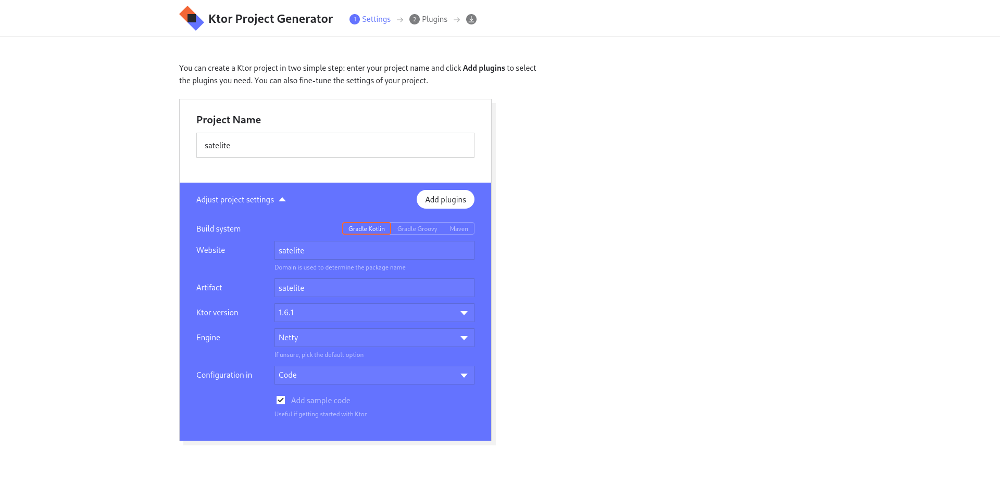
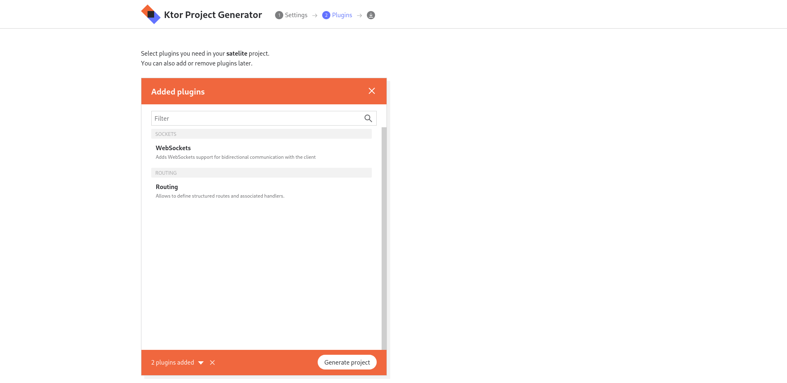
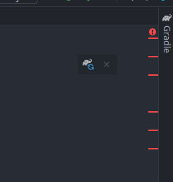
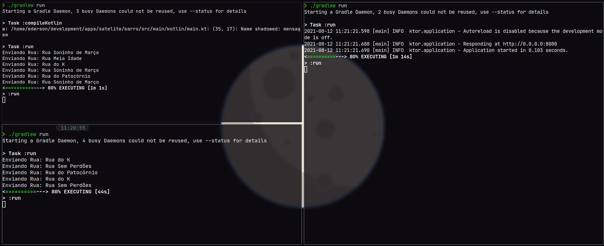

## Criando um servidor de Websocket com Ktor

## Introdução

Websockets é uma tecnologia que permite a criação de um servidor e clientes, que podem se comunicar livremente, numa conexão persistente. Ambas as partes podem enviar requisições a qualquer momento á outra parte.

Websockets são muito úteis para sistemas que precisam de uma comunicação em tempo real, com diversos usuários ao mesmo tempo, fazendo diversas ações que serão comunicadas ao servidor, como jogos.

### O quê iremos construir?

Vamos criar uma simulação simples de uma rede de carros autônomos.

Atualmente, há diversas empresas que fabricam e vendem carros que podem se "auto-pilotar", escolhendo a melhor rota de um ponto A ao ponto B. Sem bater com nenhum obstáculo ou veículo durante o caminho.

O nosso objetivo será construir um sistema simples, onde dois ou mais carros irão percorrer por um conjunto de ruas, que serão:

- Rua do K
- Rua Soninho de Março
- Rua Sem Perdões
- Rua Meia Idade
- Rua do Patocórnio
- Rua do Deninho

Esse sistema terá algumas regras para a movimentação, sendo:

- Em uma rua, poderá ter apenas um carro percorrendo;
- Um mesmo carro não pode percorrer a mesma rua duas ou mais vezes seguidas;
- Cada carro irá determinar um tempo para passar por certa rua, enviando uma requisição quando entra na rua, e quando saí. (Esse tempo será determinado de maneira aleatória para fins didáticos).

## Materiais

Será necessário para esse artigo ter um conhecimento incial da linguagem [Kotlin](https://kotlinlang.org/) e ter o [IntelliJ](https://www.jetbrains.com/idea/) ou outra IDE para Kotlin/Java na sua máquina.

## Repositório

Caso você tenha alguma dúvida em relação á um arquivo completo, árvore de arquivos,etc. [Veja neste repositório](https://github.com/kotlinautas/criando-um-servidor-de-websockets-com-ktor) com todos os arquivos fonte tanto do servidor quanto do cliente.

## Iniciando

Primeiro, vamos precisar criar dois projetos, um que será o servidor (Satelite) e o cliente (Karro). O satelite apenas servirá para receber uma mensagem vindo do cliente Karro, e mandar essa mesma mensagem para todos os clientes conectados. Enquanto o Karro irápercorrer as ruas, comunicar ao servidor quando entra e sai de uma rua, e receber as mensagens do servidor, para decidir quais ruas poderão ser percorridas.

### Criando projeto: Satelite

Inicialmente, vamos criar o projeto que será o servidor de Websockets. Você pode escolher qualquer nome para esse projeto, mas neste artigo, eu irei chama-lo de **Satelite**. Primeiro, vá ao site [start.ktor.io](https://start.ktor.io), esse site é o site oficial do Ktor para criação de um projeto.

Dentro do site, vamos colocar o nome do projeto sendo `satelite`, *Website* sendo `satelite` e *Artifact* sendo satelite também:



Depois, na secção de `plugins` vamos adicionar um único plugin sendo o plugin de `WebSockets`. Esse plugin tem um outro plugin como dependência, que é o `Routing`.



Depois, clique no botão **Generate Project** para baixar o ZIP do projeto, e descomprima esse ZIP no local que você desejar.

### Criando projetos: Karro

Agora vamos criar o projeto que será o cliente, novamente, você pode escolher qualquer nome, mas neste artigo, será usado o nome **Karro**. Vá novamente ao site [start.ktor.io](https://start.ktor.io) e coloque o nome do projeto sendo `karro`, *Website* sendo `karro` e *Artifact* sendo karro também:


Depois, na secção de `plugins` vamos adicionar um único plugin sendo o plugin de `WebSockets`. Esse plugin tem um outro plugin como dependência, que é o `Routing`.


Depois, clique no botão **Generate Project** para baixar o ZIP do projeto.

Após isso, abra esse projeto descompactado no arquivo `src/build.gradle.kts` e mude o arquivo inteiro, substituindo por isso:

```kotlin
val ktor_version: String by project
val kotlin_version: String by project
val logback_version: String by project

plugins {
    application
    kotlin("jvm") version "1.5.20"
}

group = "karro"
version = "0.0.1"
application {
    mainClass.set("karro.MainKt")
}

repositories {
    mavenCentral()
}

dependencies {
    implementation("io.ktor:ktor-websockets:$ktor_version")
    implementation("io.ktor:ktor-client-core:$ktor_version")
    implementation("io.ktor:ktor-client-cio:$ktor_version")
}
```

Após isso, aplique as alterações clicando no elefante no canto superior direito:



Após isso, vá em `src/main/kotlin` e delete o pacote `karro`. Depois disso, crie um arquivo chamado `main.kt`. Esse arquivo irá armazenar todo o código do nosso cliente.

## Programando o servidor de Websockets

Agora vamos iniciar a construção do servidor que irá receber as requisições.

Primeiro, veja que na pasta `src/main/kotlin/satelite/` há alguns arquivos:

Primeiro há o arquivo `Application.kt` que é o arquivo principal da aplicação. Esse arquivo inicia a aplicação, deixando explícito que será na porta 8080. E também inicia os plugins de `Routing` e `WebSockets`.

```kotlin
package satelite

import io.ktor.server.engine.*
import io.ktor.server.netty.*
import satelite.plugins.*

fun main() {
    embeddedServer(Netty, port = 8080, host = "0.0.0.0") {
        configureSockets()
        configureRouting()
    }.start(wait = true)
}
```

O quê precisamos prestar atenção é nessa função `configureSockets()`. Essa função que configura os websockets da nossa aplicação. Essa função está declarada em `src/main/kotlin/satelite/satelite/Sockets.kt`, que por enquanto está assim:

```kotlin
package satelite.plugins

import io.ktor.http.cio.websocket.*
import io.ktor.websocket.*
import java.time.*
import io.ktor.application.*
import io.ktor.response.*
import io.ktor.request.*
import io.ktor.routing.*

fun Application.configureSockets() {
    install(WebSockets) {
        pingPeriod = Duration.ofSeconds(15)
        timeout = Duration.ofSeconds(15)
        maxFrameSize = Long.MAX_VALUE
        masking = false
    }

    routing {
        webSocket("/") { // websocketSession
            for (frame in incoming) {
                when (frame) {
                    is Frame.Text -> {
                        val text = frame.readText()
                        outgoing.send(Frame.Text("YOU SAID: $text"))
                        if (text.equals("bye", ignoreCase = true)) {
                            close(CloseReason(CloseReason.Codes.NORMAL, "Client said BYE"))
                        }
                    }
                }
            }
        }
    }
}
```

Analizando esse arquivo, temos as seguintes partes:

- da linha 3 á 9 importamos algumas bibliotecas relacionadas ao Ktor;
- na linha 11 é criada uma função chamada `configureSockets()` que é usada no `Application.kt`;
- da linha 13 á 16 são definidas algumas variáveis relacionadas á comunicação entre o servidor e o cliente, como o tempo de ping (`PingPeriod`) que define de quanto em quanto tempo o cliente irá enviar novamente uma requsição ao servidor para manter a conexão;
- na linha 19 é iniciado um bloco `routing`, onde dentro desse bloco que estarão todas as rotas do nosso servidor de websockets;
- na linha 20 é declarada a primeira rota da aplicação (e única);
- Na linha 21 é usado um bloco `for` para iterar sobre as mensagens que estão chegando ao servidor, que não só podem ser texto, mas também outros formatos;
- Por conta que diversos tipos de mensagens podem chegar ao servidor, na linha 22 é usado um bloco `when`, com uma única condicional, que testa se a mensagem que está chegando é um texto;
- na linha 24 a mensagem é recebida pelo servidor é transformado em texto, e guardado na variável `text`;
- na linha 25 o servidor responde com o mesmo texto que foi enviado, mas com um `YOU SAID: ` na frente.
- da linha 26 á 28 é definida uma condição onde caso o texto enviado seja `bye` a conexão será fechada, enviando um aviso antes para todos os clientes conectados.

### Construindo a nossa aplicação

Agora vamos começar a mudar esse arquivo padrão para criar o servidor de websockets da nossa aplicação.

Primeiro, vamos criar uma nova classe, uma classe que irá representar uma conexão em nossa aplicação, iremos usar essa classe para armazenar todas as conexões em uma única lista. Para fazer isso, iremos usar uma `data class`. *Data Classes* são classes que apenas servem para armazenar mensagens, como é a nossa necessidade no momento.

Com isso em mente, insira essa linha no topo do arquivo:

```kotlin
data class Connection(val session: DefaultWebSocketSession)
```

- Dentro da *data class* `Connection` (conexão) há uma única propriedade, que é a propriedade `session`, que representa uma sessão do websocket, que pode tanto receber quanto enviar mensagens ao servidor, sendo assim uma representação de um cliente da nossa aplicação.

Agora, remova tudo que está dentro do bloco `routing`, com isso o arquivo ficará assim:

```kotlin
package satelite.plugins

import io.ktor.http.cio.websocket.*
import io.ktor.websocket.*
import java.time.*
import io.ktor.application.*
import io.ktor.response.*
import io.ktor.request.*
import io.ktor.routing.*

data class Connection(val session: DefaultWebSocketSession)

fun Application.configureSockets() {
    install(WebSockets) {
        pingPeriod = Duration.ofSeconds(15)
        timeout = Duration.ofSeconds(15)
        maxFrameSize = Long.MAX_VALUE
        masking = false
    }

    routing {

    }
}
```

Agora com esse bloco vazio, vamos criar uma lista vazia, que irá armazenar as conexões ao servidor:

```kotlin
package satelite.plugins

import io.ktor.http.cio.websocket.*
import io.ktor.websocket.*
import java.time.*
import io.ktor.application.*
import io.ktor.response.*
import io.ktor.request.*
import io.ktor.routing.*

data class Connection(val session: DefaultWebSocketSession)

fun Application.configureSockets() {
    install(WebSockets) {
        pingPeriod = Duration.ofSeconds(15)
        timeout = Duration.ofSeconds(15)
        maxFrameSize = Long.MAX_VALUE
        masking = false
    }

    routing {
+       val connections = mutableListOf<Connection>()
    }
}
```

Após isso, vamos adicionar a rota de websockets da nossa aplicação:

```
...
fun Application.configureSockets() {
    install(WebSockets){
        pingPeriod = Duration.ofSeconds(15)
        timeout = Duration.ofSeconds(15)
        maxFrameSize = Long.MAX_VALUE
        masking = false
    }
    routing {
        val connections = mutableListOf<Connection>()
        webSocket("/chat") {

        }
    }
}
```

- Essa função será executada a cada nova conexão com o nosso servidor, por isso, caso queremos guardar as conexões ao nosso servidor, esse é o melhor lugar, com isso em mente, vamos adicionar na linha abaixo essas instruções:

```
...
fun Application.configureSockets() {
    install(WebSockets){
        pingPeriod = Duration.ofSeconds(15)
        timeout = Duration.ofSeconds(15)
        maxFrameSize = Long.MAX_VALUE
        masking = false
    }
    routing {
        val connections = mutableListOf<Connection>()
        webSocket("/chat") {
+          val thisConnection = Connection(this)
+          connections.add(thisConnection)
        }
    }
}
```

- É criada uma variável chamada `thisConnection` que irá armazenar a conexão, usando a nossa data class `Connection` para isso, com o parâmetro `this`, que guarda a sessão do cliente.
- Após isso, essa instância da classe `Connection` é adicionada na lista de `connections`.

Agora vamos receber qualquer mensagem que um cliente enviar, e responder para todos os clientes essa mesma mensagem que foi enviada, como se a função do servidor fosse repassar uma mensagem á todos os clientes.

Vamos inserir um bloco `try`, junto com um `catch` e um `finally`. para que caso algo dê errado durante a conexão, não interfira na aplicação:

```kotlin
fun Application.configureSockets() {
    install(WebSockets){
        pingPeriod = Duration.ofSeconds(15)
        timeout = Duration.ofSeconds(15)
        maxFrameSize = Long.MAX_VALUE
        masking = false
    }
    routing {
        val connections = mutableListOf<Connection>()
        webSocket("/chat") {
            val thisConnection = Connection(this)
            connections.add(thisConnection)
+           try {
+
+           } catch (e: Exception) {
+
+           } finally {
+
+           }
        }
    }
}
```

Dentro do `try`, vamos colocar um `for` que irá iterar por todas as mensagens que irão chegar do cliente (esse mesmo processo ocorrerá em cada cliente paralelamente):

```kotlin
fun Application.configureSockets() {
    install(WebSockets){
        pingPeriod = Duration.ofSeconds(15)
        timeout = Duration.ofSeconds(15)
        maxFrameSize = Long.MAX_VALUE
        masking = false
    }
    routing {
        val connections = mutableListOf<Connection>()
        webSocket("/chat") {
            val thisConnection = Connection(this)
            connections.add(thisConnection)
            try {
+             for (frame in incoming) {
+                 frame as? Frame.Text ?: continue
+                 val response = frame.readText()
+             }
            } catch (e: Exception) {

            } finally {

            }
        }
    }
}
```

- na linha 25, essa instrução `frame as? Frame.Text ?: continue` testa se a mensagem recebida é um texto, caso sim o for irá continuar, caso não, todo o resto do for não será executado.
- Agora estamos recebendo as mensagens, e estamos guardando essas mensagens dentro de uma variável chamada `response`, que recebe apenas a mensagem em forma de texto.

Agora vamos usar um bloco `forEach` para iterar por todas as sessões de clientes dentro de `connections`, e para cada sessão, enviar a mensagem recebida:

```kotlin
fun Application.configureSockets() {
    install(WebSockets){
        pingPeriod = Duration.ofSeconds(15)
        timeout = Duration.ofSeconds(15)
        maxFrameSize = Long.MAX_VALUE
        masking = false
    }
    routing {
        val connections = mutableListOf<Connection>()
        webSocket("/chat") {
            val thisConnection = Connection(this)
            connections.add(thisConnection)
            try {
                for (frame in incoming) {
                    frame as? Frame.Text ?: continue
                    val response = frame.readText()
+                       connections.forEach {
                            if (it != thisConnection) it.session.send(response)
+                       }
                }
            } catch () {

            } finally {

            }
        }
    }
}
```

- Foi usado um `forEach{  }` simplificado, essa sintáxe permite uma fácil iteração usando um parâmetro `it` que representa um índice na lista;
- `if (it != thisConnection)` testa se a sessão da iteração atual é a mesma sessão que enviou a requisição, assim não repasando a mensagem para a mesma sessão que mandou a mensagem;
- `it.session.send` é uma função que permite enviar dados para uma sessão específica;

Depois disso, vamos montar o bloco `catch`, que irá precisar receber uma execeção, e irá mostrar essa execeção na tela (terminal):

```kotlin
fun Application.configureSockets() {
    install(WebSockets){
        pingPeriod = Duration.ofSeconds(15)
        timeout = Duration.ofSeconds(15)
        maxFrameSize = Long.MAX_VALUE
        masking = false
    }
    routing {
        val connections = mutableListOf<Connection>()
        webSocket("/chat") {
            val thisConnection = Connection(this)
            connections.add(thisConnection)
            try {
                for (frame in incoming) {
                    frame as? Frame.Text ?: continue
                    val response = frame.readText()
                    connections.forEach {
                        if (it != thisConnection) it.session.send(response)
                    }
                }
+           } catch (e: Exception) {
+               println(e.localizedMessage)
            } finally {
            }
        }
    }
}
```

Agora vamos remover um índice dessa lista caso a sessão com o cliente seja removido. Isso será feito no `finally`, que será executado ao final tanto do `try` quanto do `catch`:

```kotlin
fun Application.configureSockets() {
    install(WebSockets){
        pingPeriod = Duration.ofSeconds(15)
        timeout = Duration.ofSeconds(15)
        maxFrameSize = Long.MAX_VALUE
        masking = false
    }
    routing {
        val connections = mutableListOf<Connection>()
        webSocket("/chat") {
            val thisConnection = Connection(this)
            connections.add(thisConnection)
            try {
                for (frame in incoming) {
                    frame as? Frame.Text ?: continue
                    val response = frame.readText()
                    connections.forEach {
                        if (it != thisConnection) it.session.send(response)
                    }
                }
            } catch (e: Exception) {
                println(e.localizedMessage)
+           } finally {
+               connections.remove(thisConnection)
+           }
        }
    }
}
```

Pronto, agora temos a nossa aplicação pronta, servindo de servidor de websockets!

### Arquivo Final

O arquivo `Sockets.kt` ao final está assim:

```kotlin
package satelite.plugins

import io.ktor.application.*
import io.ktor.routing.*
import io.ktor.websocket.*
import io.ktor.http.cio.websocket.*
import java.time.Duration

data class Connection(val session: DefaultWebSocketSession)

fun Application.configureSockets() {
    install(WebSockets){
        pingPeriod = Duration.ofSeconds(15)
        timeout = Duration.ofSeconds(15)
        maxFrameSize = Long.MAX_VALUE
        masking = false
    }
    routing {
        val connections = mutableListOf<Connection>()
        webSocket("/chat") {
            val thisConnection = Connection(this)
            connections.add(thisConnection)
            try {
                for (frame in incoming) {
                    frame as? Frame.Text ?: continue
                    val response = frame.readText()
                    connections.forEach {
                        if (it != thisConnection) it.session.send(response)
                    }
                }
            } catch (e: Exception) {
                println(e.localizedMessage)
            } finally {
                connections.remove(thisConnection)
            }
        }
    }
}
```

## Programando o cliente de WebSockets

Agora abra o projeto `karro` no seu IntelliJ, que será o cliente do nosso servidor de websockets.

Primeiro, vá ao arquivo `src/main/kotlin/main.kt` e vamos inserir as importações:

```kotlin
import io.ktor.client.* // Cliente do Ktor
import io.ktor.client.features.websocket.* // Websocket do Ktor
import io.ktor.http.* // propriedades relacionadas á HTTP
import io.ktor.http.cio.websocket.* // Websocket do Ktor
import kotlinx.coroutines.* // Coroutines do Ktolin
```

Depois disso, vamos abaixo inserir a definição de duas variáveis globais:

- Uma lista representando as ruas disponíveis (que nenhum carro está passando)
- Um histórico (para sabermos qual foi a última rua que o carro passou)

Podemos fazer isso da seguinte maneira:

```kotlin
...
+ var ruas = mutableListOf("Rua do K", "Rua Soninho de Março", "Rua Sem Perdões", "Rua Meia Idade", "Rua do Patocórnio", "Rua do Deninho")
+ var histórico = mutableListOf("")
```

Agora vamos iniciar a adicionar a função `main` do cliente:

```kotlin
...
var ruas = mutableListOf("Rua do K", "Rua Soninho de Março", "Rua Sem Perdões", "Rua Meia Idade", "Rua do Patocórnio", "Rua do Deninho")
var histórico = mutableListOf("")

+ fun main(){
+
+ }
```

Agora vamos definir uma variável chamada `client` que irá armazenar o plugin de websockets:

```kotlin
...
var ruas = mutableListOf("Rua do K", "Rua Soninho de Março", "Rua Sem Perdões", "Rua Meia Idade", "Rua do Patocórnio", "Rua do Deninho")
var histórico = mutableListOf("")

fun main(){
+    val client = HttpClient {
+        install(WebSockets)
+    }
}
```

- É usado a função `install` vinda do Ktor para instalar um plugin na aplicação.

Agora vamos usar um bloco chamado `runBlocking`, que serve para inciar uma nova co-rotina:

```kotlin
...
var ruas = mutableListOf("Rua do K", "Rua Soninho de Março", "Rua Sem Perdões", "Rua Meia Idade", "Rua do Patocórnio", "Rua do Deninho")
var histórico = mutableListOf("")

fun main(){
    val client = HttpClient {
        install(WebSockets)
    }

+    runBlocking {
+
+    }
}
```

Agora vamos dentro do bloco `runBlocking` adicionar a conexão ao servidor de Websockets:

```kotlin
var ruas = mutableListOf("Rua do K", "Rua Soninho de Março", "Rua Sem Perdões", "Rua Meia Idade", "Rua do Patocórnio", "Rua do Deninho")
var histórico = mutableListOf("")

fun main() {
    val client = HttpClient {
        install(WebSockets)
    }
    runBlocking {
+        client.webSocket(method = HttpMethod.Get, host = "127.0.0.1", port = 8080, path = "/chat") {
+
+        }
    }
}
```

- Na função `client.webSocket` é passado alguns parâmetros, como `method`, que se refere que método HTTP para se conectar ao websocket, `host` sendo o IP da máquina que está rodando o servidor, `port` a porta do servidor, e `path` o caminho da rota que está aceitando o websocket.

Agora, Após esse bloco `runBlocking`, vamos fechar o cliente. Isso irá ocorrer caso o cliente perca conexão com o servidor.

```kotlin
var ruas = mutableListOf("Rua do K", "Rua Soninho de Março", "Rua Sem Perdões", "Rua Meia Idade", "Rua do Patocórnio", "Rua do Deninho")
var histórico = mutableListOf("")

fun main() {
    val client = HttpClient {
        install(WebSockets)
    }
    runBlocking {
        client.webSocket(method = HttpMethod.Get, host = "127.0.0.1", port = 8080, path = "/chat") {

        }
    }
+    client.close()
}
```

Vamos agora, criar três funções, sendo:

- `enviarMensagem` - Envia uma mensagem recebendo um texto como parâmetro;
- `enviarRua` irá pegar uma rua aleatória da lista de ruas disponíveis, enviar essa rua, esperar um tempo aletório (de 5 á 15 segundos) e enviar uma mensagem novamente dizendo que o carro saiu da rua;
- `receberMensagens` irá receber as mensagens enviadas pelo servidor ao cliente, e interpretar essas mensagens, adicionando ou removendo na lista de ruas;

Todas essas funções terão um `suspend` pois serão funções assíncronas, podendo funcionar independente da outra.

### enviarMensagem

A função enviar mensagem será curta, primeiro, precisamos criar um bloco `try` e `catch`:

```kotlin
suspend fun DefaultClientWebSocketSession.enviarMensagem(mensagem: String){
+     try {
+ 
+     } catch (e: Exception) {
+
+     }
+ }
```

Depois disso, vamos adicionar uma função `send` que irá enviar a mensagem ao servidor:

```kotlin
suspend fun DefaultClientWebSocketSession.enviarMensagem(mensagem: String){
    try {
+       send(mensagem)
    } catch (e: Exception) {
+        println("Erro enquanto enviava: " + e.localizedMessage)
+        return
    }
}
```

- Além de adicionarmos o `send(mensagem)` também adicionamos no bloco `catch` uma mensagem de erro, e um `return` para fechar a função.

### enviarRua

Agora vamos começar a codificar a função `enviarRua`.

Dentro dessa função vamos criar um bloco `while` infinito para que o código que envie a rua sempre esteja rodando:

```kotlin
+ suspend fun DefaultClientWebSocketSession.enviarRua() {
+     while (true) {
+ 
+     }
+ }
```

Agora, dentro desse `while` vamos adicionar uma variável chamada `rua` que irá guardar uma rua aleatória da lista de ruas disponíveis:

```kotlin
suspend fun DefaultClientWebSocketSession.enviarRua() {
    while (true) {
+        var rua = ruas.random()
+
+        while (histórico.last() == rua){
+            rua = ruas.random()
+        }
+
+        histórico.add(rua)
    }
}
```

- A rua é pega usando uma função `ruas.random()` que pega um índice aleatório da lista de ruas disponíveis;
- Enquanto o último registro do histórico for igual á rua selecionada, uma nova rua será selecionada;
- Após isso, a rua escolhida é adicionada á lista do histórico;

Depois disso, vamos enviar uma mensagem avisando que o carro está entrando na rua selecionada.

Para enviar essa mensagem, como o exemplo desse artigo é apenas para fins didáticos, não iremos usar JSON ou outro método mais complexo. Vamos usar um **Caractere Separador**, mas o quê é isso?

O Caractere Separador será um caractere que vamos usar para separ um texto, e cada seção após essa separação, irá representar um dado que estamos enviando.

Por exemplo, vamos supor que queremos enviar uma mensagem, dizendo que estamos indo para a rua "Rua do K", podemos representar isso da seguinte maneira:

`Rua do K:vindo`

E se recebermos uma mensagem desse jeito, podemos usar uma função que está presente em todas as linguagens de programação, que é a função `split`, que transforma um texto em uma lista, separando as partes do texto em índices da lista usando um texto, que no nosso caso, será `:`. O primeiro índice do array será a rua, enquanto o segundo índice será o `vindo` ou `saindo`, indicando se o carro está vindo para uma rua, ou se está saindo de uma rua.

Voltando ao código, podemos fazer isso dessa maneira:

```kotlin
suspend fun DefaultClientWebSocketSession.enviarRua() {
    while (true) {
        var rua = ruas.random()

        while (histórico.last() == rua){
            rua = ruas.random()
        }

        histórico.add(rua)

+        println("Enviando Rua: $rua")
+        enviarMensagem("$rua:vindo")
    }
}
```

- Mostramos na tela qual rua está sendo enviada, e enviamos a mensagem para o servidor usando a função `enviarMensagem`.

Agora precisamos gerar um tempo aleatório, de 5 á 15 segundos, esperar esse tempo, e enviar uma mensagem dizendo que o carro já saiu da rua.

```kotlin
suspend fun DefaultClientWebSocketSession.enviarRua() {
    while (true) {
        var rua = ruas.random()

        while (histórico.last() == rua){
            rua = ruas.random()
        }

        histórico.add(rua)

        println("Enviando Rua: $rua")
        enviarMensagem("$rua:vindo")

+        val tempoParaProximaRua = (5..15).shuffled().first()
+        delay((tempoParaProximaRua * 1000).toLong())
+
+        enviarMensagem("$rua:saindo")
    }
}
```

- Guardamos um número aleatório de 5 á 15 na variável `tempoParaProximaRua`, gerando um array de 5 á 15, embaralhando o array e escolhendo o primeiro número;
- usamos a função `delay` para esperar um tempo, multiplicando `tempoParaProximaRua` por 1000, para transformar segundos em milisegundos;
- depois, usamos a função `enviarMensagem` para enviar a mensagem avisando que o carro saiu da rua;

### receberMensagens

vamos criar a função `receberMensagens` para receber as mensagens do servidor, interpretar, e mudar a lista de ruas disponíveis, primeiro, vamos criar a função:

```kotlin
+ suspend fun DefaultClientWebSocketSession.receberMensagens() {
+ 
+ }
```

Vamos criar os blocos `try` e `catch` novamente:

```kotlin
suspend fun DefaultClientWebSocketSession.receberMensagens() {
+    try {
+
+    } catch (e: Exception) {
+        println("Erro enquanto recebia" + e.localizedMessage)
+    }
}
```

- Dentro do `catch` mostramos na tela o erro para facilidar o processo de debug caso dê algum erro;

Agora, Vamos criar um `for` para pegar as mensagens que estão chegando:

```kotlin
suspend fun DefaultClientWebSocketSession.receberMensagens() {
    try {
+        for (mensagem in incoming) {
+           mensagem as? Frame.Text ?: continue
+
+        }
    } catch (e: Exception) {
        println("Erro enquanto recebia" + e.localizedMessage)
    }
}
```

- Filtramos a mensagem, fazendo com que a mensagem tenha de ser um texto, caso não seja, o `for` irá continuar normalmente;

Agora vamos pegar a mensagem e transformar em uma lista, separando usando o `:`

```kotlin
suspend fun DefaultClientWebSocketSession.receberMensagens() {
    try {
        for (mensagem in incoming) {
            mensagem as? Frame.Text ?: continue

+           val mensagem = mensagem.readText().split(":")

        }
    } catch (e: Exception) {
        println("Erro enquanto recebia" + e.localizedMessage)
    }
}
```

- Estamos pegando a mensagem, lendo o texto com `.readText()`, e separando em índices de uma lista com o `.split(":")`.

Agora, vamos adicionar um `if` para filtar as mensagens, e caso a lista `mensagem` não tenha dois índices (a rua e a informação se o carro está chegando ou saindo da rua) a mensagem será ignorada:

```kotlin
suspend fun DefaultClientWebSocketSession.receberMensagens() {
    try {
        for (mensagem in incoming) {
            mensagem as? Frame.Text ?: continue

            val mensagem = mensagem.readText().split(":")

+           if (mensagem.size != 2) continue
        }
    } catch (e: Exception) {
        println("Erro enquanto recebia" + e.localizedMessage)
    }
}
```

Agora vamos definir duas variáveis referentes aos dados de dentro da mensagem:

```kotlin
suspend fun DefaultClientWebSocketSession.receberMensagens() {
    try {
        for (mensagem in incoming) {
            mensagem as? Frame.Text ?: continue

            val mensagem = mensagem.readText().split(":")

            if (mensagem.size != 2) continue

+            val rua = mensagem[0]
+            val vindo = mensagem[1] == "vindo"
        }
    } catch (e: Exception) {
        println("Erro enquanto recebia" + e.localizedMessage)
    }
}
```

- A rua como é o primeiro dado, está no índice 0, enquando a indicação se o carro está entrando ou saindo da rua é o segundo dado, estando no índice 1;
- a variável `vindo` recebe verdadeiro ou falso, sendo assim **Booleana**, como o carro pode apenas entrar ou sair, podemos representar isso com verdadeiro ou falso;

Agora vamos adicionar e remover a rua dependendo se a variável `vindo` é verdadeira ou falsa:

```kotlin
suspend fun DefaultClientWebSocketSession.receberMensagens() {
    try {
        for (mensagem in incoming) {
            mensagem as? Frame.Text ?: continue

            val mensagem = mensagem.readText().split(":")

            if (mensagem.size != 2) continue

            val rua = mensagem[0]
            val vindo = mensagem[1] == "vindo"

+            if (vindo) ruas.remove(rua) else ruas.add(rua)
        }
    } catch (e: Exception) {
        println("Erro enquanto recebia" + e.localizedMessage)
    }
}
```

- Caso o carro esteja entrando em alguma rua específica, essa rua será removida da lista de ruas disponíveis;
- E caso o carro esteja saindo em alguma rua específica, essa rua será adicionada da lista de ruas disponíveis;

Agora vamos integrar tudo dentro da `main`.

Vamos criar referências para as duas corotinas primeiramente:

```kotlin
fun main() {
    val client = HttpClient {
        install(WebSockets)
    }
    runBlocking {
        client.webSocket(method = HttpMethod.Get, host = "127.0.0.1", port = 8080, path = "/chat") {

+            val iniciarReceberMensagens = launch { receberMensagens() }
+            val iniciarEnviarRua = launch { enviarRua() }

        }
    }
    client.close()
}
```

Agora vamos iniciar as duas corotinas:

```kotlin
fun main() {
    val client = HttpClient {
        install(WebSockets)
    }
    runBlocking {
        client.webSocket(method = HttpMethod.Get, host = "127.0.0.1", port = 8080, path = "/chat") {

            val iniciarReceberMensagens = launch { receberMensagens() }
            val iniciarEnviarRua = launch { enviarRua() }

+            iniciarEnviarRua.join()
+            iniciarReceberMensagens.cancelAndJoin()
        }
    }
    client.close()
}
```

### Arquivo Final

Ao final, teremos esse arquivo:

```kotlin
package karro

import io.ktor.client.*
import io.ktor.client.features.websocket.*
import io.ktor.http.*
import io.ktor.http.cio.websocket.*
import kotlinx.coroutines.*

var ruas = mutableListOf("Rua do K", "Rua Soninho de Março", "Rua Sem Perdões", "Rua Meia Idade", "Rua do Patocórnio", "Rua do Deninho")
var histórico = mutableListOf("")

fun main() {
    val client = HttpClient {
        install(WebSockets)
    }
    runBlocking {
        client.webSocket(method = HttpMethod.Get, host = "127.0.0.1", port = 8080, path = "/chat") {

            val iniciarReceberMensagens = launch { receberMensagens() }
            val iniciarEnviarRua = launch { enviarRua() }

            iniciarEnviarRua.join()
            iniciarReceberMensagens.cancelAndJoin()
        }
    }
    client.close()
    println("Connection closed. Goodbye!")
}

suspend fun DefaultClientWebSocketSession.receberMensagens() {
    try {
        for (mensagem in incoming) {
            mensagem as? Frame.Text ?: continue

            val mensagem = mensagem.readText().split(":")

            if (mensagem.size != 2) continue

            val rua = mensagem[0]
            val vindo = mensagem[1] == "vindo"

            if (vindo) ruas.remove(rua) else ruas.add(rua)
        }
    } catch (e: Exception) {
        println("Erro enquanto recebia" + e.localizedMessage)
    }
}

suspend fun DefaultClientWebSocketSession.enviarRua() {
    while (true) {
        var rua = ruas.random()

        while (histórico.last() == rua){
            rua = ruas.random()
        }

        histórico.add(rua)

        println("Enviando Rua: $rua")
        enviarMensagem("$rua:vindo")

        val tempoParaProximaRua = (5..15).shuffled().first()
        delay((tempoParaProximaRua * 1000).toLong())

        enviarMensagem("$rua:saindo")
    }
}

suspend fun DefaultClientWebSocketSession.enviarMensagem(mensagem: String){
    try {
        send(mensagem)
    } catch (e: Exception) {
        println("Erro enquanto enviava: " + e.localizedMessage)
        return
    }
}
```

## Executando as nossas aplicações

Agora vamos executar as duas aplicações, recomendo usar algum terminal, como o terminal do próprio IntelliJ, clicando no menu **Terminal** na barra inferior.

Precisaremos de três terminais:

- Um aberto no projeto `satelite`
- e outros dois abertos no projeto `karro`

Primeiro, execute o comando `gradle run` (Windows) ou `./gradlew run` (Linux) no projeto `satelite` para iniciar o servidor de websockets.

Depois disso, execute o comando `gradle run` (Windows) ou `./gradlew run` (Linux) nos dois terminais que estão com o projeto `karro` aberto. Com isso, as duas instâncias do projeto `karro` vão começar a se comunicar, e impedir que os dois karros estejam na mesma rua ao mesmo tempo.

Veja nessa imagem como ficaria durante o funcionamento:



Ao final, experimente aumentar o número de instâncias de `karro`, aumentar e diminuir o número de ruas,etc. para fixar e entender o quê fizemos nessas duas aplicações.

Obrigado por ler 💙
